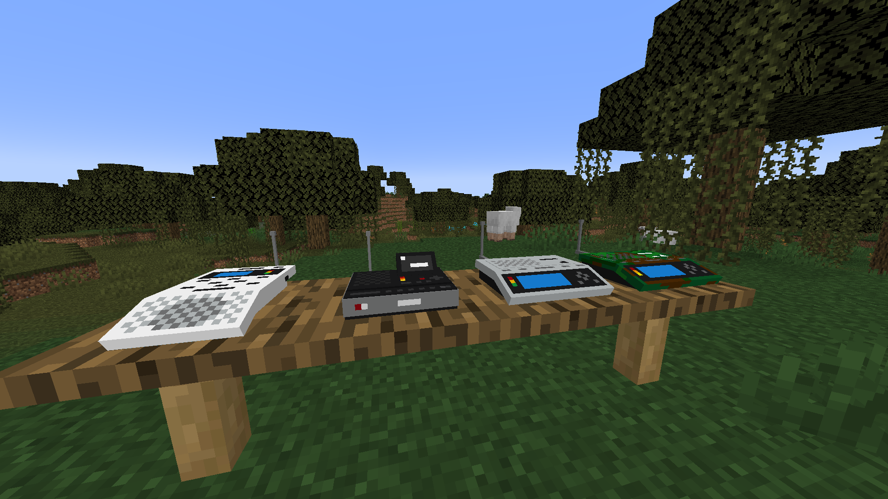
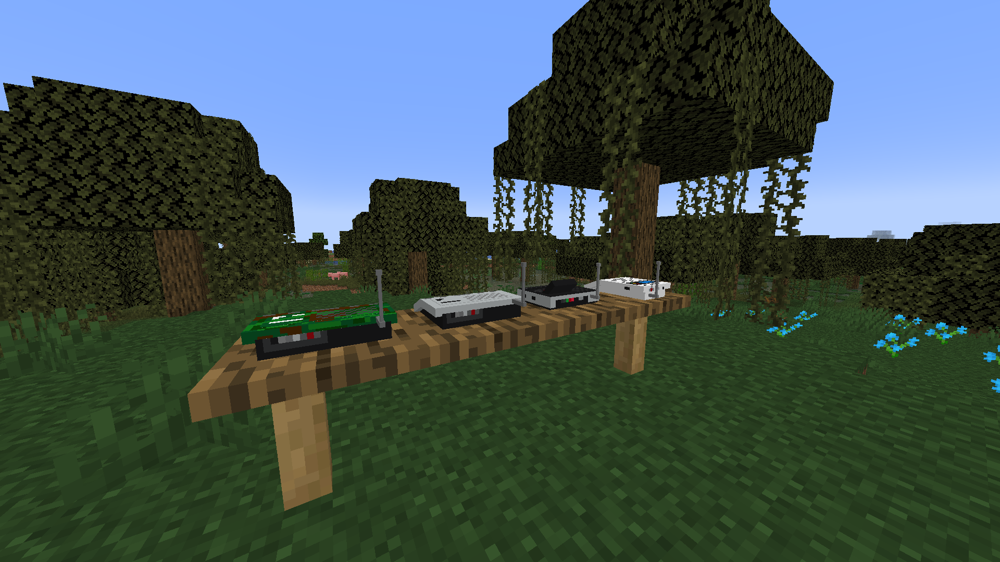
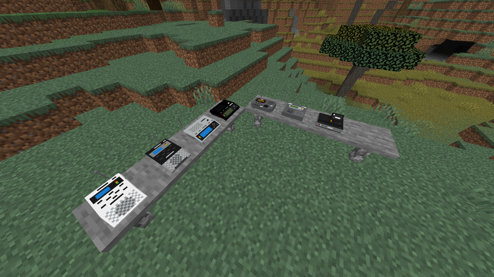

# The Weather Radio Mod

The Weather Radio Mod adds various different kind of weather and AM/FM radios into Minecraft for your decorating needs!

This mod is currently only available for 1.18.2, however moving to future versions is planned.

Currently the weather radios are not functional and serve as decoration purposes only, however the ability to play Icecast streams and other forms of audio maybe added in future versions.

Curseforge Link:
https://www.curseforge.com/minecraft/mc-mods/the-weather-radio-mod
**For some reason Curseforge disallows mods with the word "Mod" in the name, and for this reason it is called "T3chyy's Weather Radios".**

# How to install:

1. Download The Weather Radio Mod from the Releases page.

2. Make sure you download [Minecraft Forge 1.18.2](https://files.minecraftforge.net/net/minecraftforge/forge/index_1.18.2.html).

2. Take the .jar file and move it into your ``mods`` folder in ``.minecraft``, 
If you don't have a mods folder, create one!

3. Boot up Minecraft and enjoy!

# Screenshots

# TODO:
- [ ] Add crafting recipes and parts like tuners, PCBs and more.
- [ ] Ability to play audio streams like police scanners and NWR channels.
- [x] Tooltips containing history about the radio and its rarity.
- [ ] Radios from different brands like Sangean, Uniden, Reecom, Radioshack, etc.

# Bugs

Report bugs in Issues
